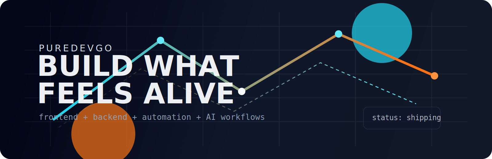

# 

<div align="center">

## `PUREDEVGO // SYSTEM ONLINE`

**Shipping interfaces with voltage, backend with discipline, and ideas that refuse to stay small.**

[](https://github.com/PureDevGo)
[](https://github.com/PureDevGo?tab=followers)
[](https://github.com/PureDevGo?tab=repositories)

`full-stack` `ai-workflows` `toolmaker` `design-minded engineer`

</div>

---

## `/identity`

```ts
export const PureDevGo = {
  class: "FullStackEngineer",
  base: "China",
  mode: "Build fast, polish hard, ship sharp",
  domains: ["Frontend", "Backend", "Automation", "AI Product"],
  trait: "Turns raw ideas into things people actually want to use",
};
```

```txt
===========================================================
MISSION
Build products that look alive, feel fast, and scale.
Cut noise. Keep taste. Make systems people trust.
===========================================================
```

---

## `/mission-control`

<table>
  <tr>
    <td width="34%" valign="top">

### `current_signal`

- Designing interfaces with stronger personality
- Building developer tools and automation flows
- Exploring AI-native product experiences
- Pushing side projects from idea to launch

    </td>
    <td width="33%" valign="top">

### `looking_for`

- Smart product collaborations
- Interesting open source work
- Brutally useful tool ideas
- Teams that care about craft

    </td>
    <td width="33%" valign="top">

### `uplinks`

[](https://github.com/PureDevGo)
[](https://gitee.com/PureDevGo)
[](https://space.bilibili.com/YOUR_ID)
[](mailto:you@example.com)

    </td>
  </tr>
</table>

---

## `/loadout`

<div align="center">
  
</div>

```yaml
frontend:
  - React
  - Next.js
  - TypeScript
  - Tailwind

backend:
  - Node.js
  - Go
  - Python
  - PostgreSQL

build_style:
  - crisp UX
  - strong DX
  - automation first
  - fast iteration
```

---

## `/featured-builds`

| Codename | Signal | Core Stack |
| --- | --- | --- |
| `NEON FORGE` | A flagship product, dashboard, or SaaS with a clean UX edge | `Next.js` `TypeScript` `Postgres` |
| `GHOST OPS` | A CLI, automation engine, or workflow tool that saves real time | `Go` `Node.js` |
| `SIGNAL LAB` | An AI experiment, internal platform, or idea incubator | `Python` `LLM` `Data` |

```txt
Rule: keep only the 3 projects that make people click.
If a repo is not strong, hide it. Curate like a gallery.
```

---

## `/telemetry`

<div align="center">
  
  
</div>

<div align="center">
  
</div>

<div align="center">
  
</div>

---

## `/manifesto`

```txt
I like codebases that still make sense at 2AM.
I like interfaces with pulse, contrast, and intent.
I like products that feel inevitable once they exist.
```

<div align="center">

`taste-driven`   `high-agency`   `systems-first`   `ship-it energy`

</div>

---

## `/boot-sequence`

```bash
git clone https://github.com/PureDevGo/PureDevGo.git
cd PureDevGo
build something impossible-looking
ship it anyway
```
